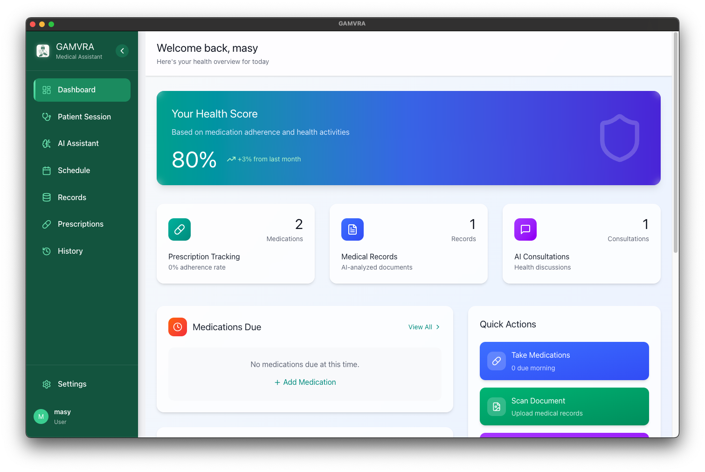

# 🧠 GAMVRA – AI Assistant Powered by Gemma 3n (Offline-First)

GAMVRA is a powerful, offline-first AI assistant built using [Gemma 3n](https://ai.google.dev/gemma) and packaged as a cross-platform desktop app using **Electron**. It’s fast, private, and designed to help you with coding, writing, and reasoning tasks—**without an internet connection**.

---

## 🚀 Features

- ✨ **Offline AI Assistant** – Powered by Gemma 3n running locally via ONNX.
- ⚡ **Fast Inference** – Optimized performance with quantized models (Q4/Q8/FP16/FP32).
- 🔐 **Private & Secure** – No data is sent to any server. All interactions are processed locally.
- 🪄 **Multimodal Ready** – Support for text, vision, and audio models via plugin architecture.
- 🎨 **Modern UI** – Built with Electron + React + Tailwind for a sleek and responsive interface.
- 🧩 **Plugin System** – Extendable with custom skills like OCR, translation, code generation, etc.
- 💻 **Cross-Platform** – Works on macOS, Windows, and Linux.

---

## 📦 Tech Stack

| Component         | Tech                          |
|------------------|-------------------------------|
| Language Model    | [Gemma 3n](https://ai.google.dev/gemma) via ONNX |
| Runtime           | [Electron](https://www.electronjs.org/)          |
| Frontend UI       | React + Tailwind CSS          |
| Model Inference   | ONNX Runtime + WebAssembly / Native |
| Packaging         | electron-builder               |

---

## 🖥️ Setup & Installation

### Prerequisites

- Node.js (>= 18)
- Python 3.11 (for model preprocessing, if needed)
- Git
- yarn or npm

### 1. Clone the Repository

\`\`\`bash
git clone https://github.com/masymars/GAMVRA.git
cd GAMVRA
\`\`\`

### 2. Install Dependencies

\`\`\`bash
npm install
# or
yarn install
\`\`\`

### 3. Download Gemma 3n Model (ONNX Format)

\`\`\`bash
# Put your Gemma model files in:
resources/models/gemma-3n/
\`\`\`

> ⚠️ You must convert and optimize Gemma 3n to ONNX format if you haven't already.

### 4. Run the App

\`\`\`bash
npm run dev
# or
yarn dev
\`\`\`

### 5. Build for Production

\`\`\`bash
npm run build
# or
yarn build
\`\`\`

---

## 🧠 Example Use Cases

- 💬 Conversational AI (Chat with local LLM)
- 🧾 OCR with vision transformer plugins
- 🧑‍💻 Code helper & snippet generator
- 🎓 AI Tutor & learning assistant
- 🖼️ Image captioning and vision analysis

---

## 🛠 Project Structure

\`\`\`
/out               → Electron build output  
/resources         → Model files, images, assets  
/src               → Main source code (React + Electron)  
  └─ /main         → Electron main process  
  └─ /renderer     → Frontend UI  
  └─ /models       → Inference helpers  
\`\`\`

---

## 📸 Screenshots

> Add your screenshots in the `/screenshots` folder.

| Main Chat Interface | OCR Plugin |
|---------------------|------------|
|  |  |

---

## 📄 License

MIT License © 2025 [Masymars](https://github.com/masymars)

---

## 🤝 Contributing

Pull requests are welcome. For major changes, please open an issue first to discuss what you'd like to change.

---

## 💡 Credits

- [Gemma 3n](https://ai.google.dev/gemma) by Google DeepMind  
- [ONNX Runtime](https://onnxruntime.ai/)  
- [Electron](https://electronjs.org)  
- [React](https://reactjs.org)  
- Icons by [Lucide](https://lucide.dev)

---

## 🌐 Connect

- GitHub: [@masymars](https://github.com/masymars)
- Company: [Neuralful AI Ltd](https://neuralful.com)
